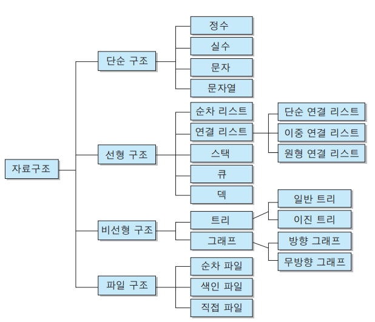

# Algoritrhm 공부 디렉터리

## 알고리즘이란

알고리즘은 어떠한 문제를 해결하기 위한 일련의 절차를 공식화한 형태로 표현한 것

## 알고리즘의 조건

### 좋은 알고리즘이란 다음 조건을 충족시켜야 한다

* `입력` : 외부에서 제공되는 자료가 0개 이상 존재한다.
* `출력` : 적어도 2개 이상의 서로다른 결과를 내어야 한다. 모든 입력에 하나의 출력이 나오면 안된다
* `명확성` : 수행 과정은 명확하고 모호하지 않은 명령어로 구성되어야 한다,.
* `유한성` : 유한 번의 명령어를 수행 후 유한 시간 내에 종료한다.
* `효율성` : 모든 과정은 명백하게 실행 가능(검증 가능)한 것이어야 한다.

좋은 자료들 : https://www.inflearn.com/course/%EC%95%8C%EA%B3%A0%EB%A6%AC%EC%A6%98-%EA%B0%95%EC%A2%8C/#curriculum

## 알고리즘에 필요한 기본 개념

* 시간 복잡도
* 자료 구조
* 정렬

## 시간 복잡도
    문제를 해결하는데 걸리는 시간과 입력의 함수 관계 프로그램을 작성 할 때  
    입력의 크기에 따라서 프로그램이 계산하는 횟수가 크게 달라진다.  
    시간 복잡도를 나타낼 때에는 Big O 표기법을 이용한다. 

| 시간 복잡도 | 설명 |
| --- |:---:|
| O(1) | 상수 형태. n의 값에 상관 없이 일정한 양의 계산만 한다.
| O(log n) | 로그 형태
| O(n) | 선형
| O(n log n) | 선형로그 형태
| O(n2), O(n3), ... | 다차 형태
| O(2n) | 지수 형태
| O(n!) | 팩토리얼 형태

맨 위부터 시간 복잡도가 낮고 빠르고, 아래로 갈 수록 시간 복잡도가 높고 느려진다.

## 자료구조

자료구조란 데이터 사이의 관계를 반영한 저장구조 및 조작방법을 뜻함.  
데이터에 맞는 특성의 자료구조를 잘 사용하는 것이 중요하다.

사진 출처 : https://wayhome25.github.io/cs/2017/04/17/cs-18/

* 선형 자료 구조 : 한 종료의 데이터가 선처럼 길게 나열된 자료구조.
* 비선형 자료구조 : 선형 자료구조가 아닌 모든 자료구조. i 번째 값을 탐색한 뒤의 i+1이 정해지지 않은 구조
* 파일 구조 : 서로 관련된 필드들로 구성된 레코드의 집합인 파일에 대한 자료구조

## 배열
* 가장 일반적인 구조. 메모리 상에 같은 타입의 자료가 연속적으로 저장된다.

## 연결 리스트
* 노드를 단위로 한다. 노드는 자료와 다음 노드를 가리키는 참조값으로 구성되어있다. 노드가 다음 노드로 아무것도 가리키지 않으면 리스트의 끝이다.

## 원형 연결 리스트
* 각 노드는 다음 노드를 가리키고, 마지막 노드가 처음 노드를 가리키는 연결 리스트이다.

## 이중 연결 리스트
* 각 노드는 이전 노드와 다음 노드를 가리키는 참조값으로 구성된다. 처음 노드의 이전 노드와 마지막 노드의 다음 노드는 없다.

## 해시테이블
* 개체가 해시값에 따라 인덱싱 된다.

## 비선형 자료구조

## 그래프 
* 꼭짓점과 꼭짓점을 잇는 변으로 구성된다.

## 트리
* 뿌리와 뿌리 또는 다른 꼭짓점을 단 하나의 부모로 갖는 꼭짓점들로 이루어진 구조. 부모 자식 관계는 변으로 표현된다.